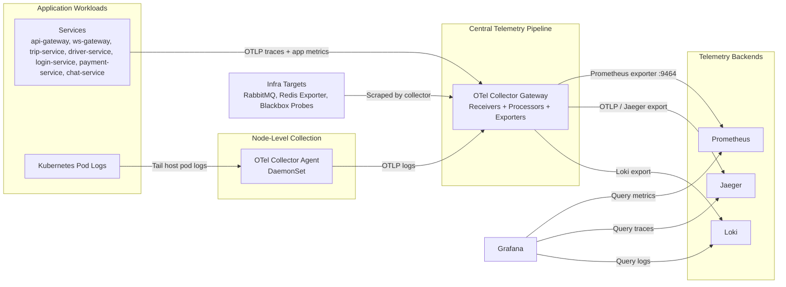
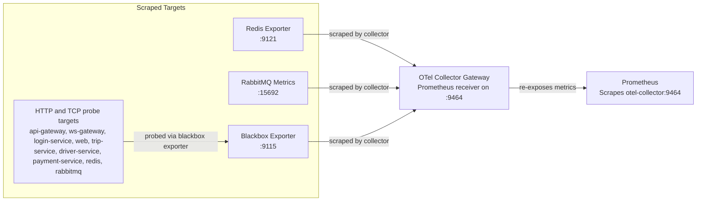
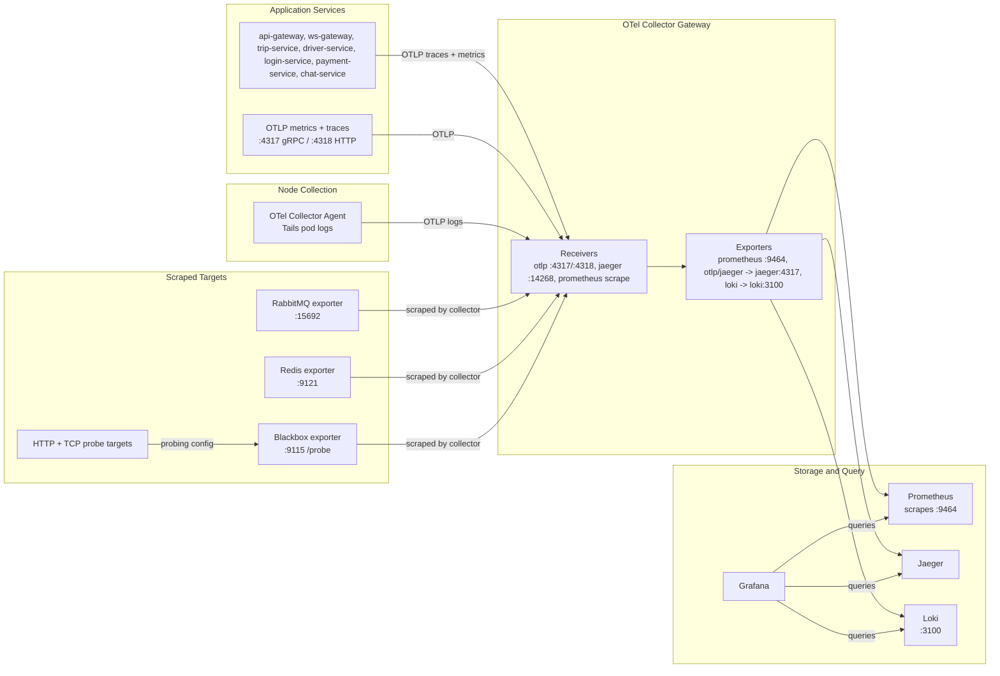

# Recommended Metrics And Logs

This document lists recommended production metrics and logging fields for the ride platform.

## Observability Architecture (Kubernetes)

This repository uses a hub-and-spoke observability model:

- Application services and node agents send telemetry to a central OpenTelemetry Collector gateway.
- Prometheus reads metrics from the gateway.
- Jaeger stores traces.
- Loki stores logs.
- Grafana queries Prometheus, Jaeger, and Loki for dashboards and triage.

The architecture is intentionally split between gateway and agent collectors:

- Gateway collector: central processing, enrichment, routing/export.
- Agent collector: node-local log tailing from Kubernetes pod log files.

### Observability Stack Diagram

### Metrics Scrape Path

### End-to-End Signal Flow

This is the full path, including the transport, port, and the main metric surface at each hop.

| Signal | Source | Transport | Port | Collector action | Metric surface |
|---|---|---|---|---|---|
| Traces | Application services | OTLP gRPC / OTLP HTTP | `4317` / `4318` | Gateway batches and exports to Jaeger | Service spans, HTTP spans, gRPC spans, DB spans, RabbitMQ spans |
| App metrics | Application services | OTLP gRPC / OTLP HTTP | `4317` / `4318` | Gateway re-exposes metrics for Prometheus | `ride_http_requests_total`, `ride_grpc_requests_total`, `ride_ws_connections_active`, `ride_rmq_publish_total`, `ride_redis_stream_replay_total` |
| Logs | Kubernetes pod stdout | Node agent tails files, then OTLP | host path -> `4317` | Agent forwards logs to gateway, gateway exports to Loki | JSON app logs with `trace_id`, `span_id`, `service.name`, `operation` |
| Infra metrics | RabbitMQ / Redis Exporter / Blackbox | Prometheus scrape via gateway | `15692`, `9121`, `/probe` | Gateway scrapes exporter endpoints and probe targets | RabbitMQ queue depth, Redis health, probe success/latency |
| Prometheus scrape | Prometheus -> OTel collector gateway | Prometheus pull | `9464` | Prometheus scrapes the gateway's metrics endpoint | Aggregated metrics from app OTLP + scraped exporter metrics |
| Trace backend | OTel collector gateway -> Jaeger | OTLP export | `4317` | Gateway exports spans to Jaeger | Trace storage and trace search |
| Log backend | OTel collector gateway -> Loki | Loki HTTP push | `3100` | Gateway pushes logs to Loki | Queryable log streams |

## How the Kubernetes files are correlated

### 1) Collector gateway and agent

- Files under `infra/development/k8s/observability/`

Contains multiple resources:

- `otel-gateway-configmap.yaml`
  - Contains `ConfigMap/otel-collector-gateway-config`
  - Defines gateway collector pipelines.
  - Receivers: `prometheus`, `otlp`, `jaeger`.
  - Processors: `resource`, `memory_limiter`, `batch`.
  - Exporters: `prometheus`, `otlp/jaeger`, `loki`.
- `collector-gateway-deployment.yaml`
  - Contains `Deployment/otel-collector-gateway`
  - Runs one central collector pod.
  - Exposes ports for OTLP, Jaeger ingest compatibility, metrics, and health.
  - Also contains `Service/otel-collector`, the stable in-cluster endpoint used by apps and the log agent.
- `otel-agent-configmap.yaml`
  - Contains `ConfigMap/otel-collector-agent-config`
  - Defines node agent collector behavior for logs.
- `collector-agent-daemonset.yaml`
  - Contains `DaemonSet/otel-collector-agent`
  - Runs one pod per node and forwards pod logs to `otel-collector:4317`.

- Files: `infra/development/k8s/observability/prometheus-config.yaml`, `infra/development/k8s/observability/prometheus-deployment.yaml`
Contains:

- `prometheus-config.yaml`
  - Contains `ConfigMap/prometheus-config`
  - Prometheus scrape config.
  - Alert rules.
- `prometheus-deployment.yaml`
  - Contains `Deployment/prometheus`
  - Time-series storage and rule evaluation.
- `prometheus-deployment.yaml`
  - Contains `Service/prometheus`
  - Used by Grafana datasource.

Prometheus primarily scrapes `otel-collector:9464`, which acts as a unified metrics source.

### 3) Grafana

- Files: `infra/development/k8s/observability/grafana-datasources.yaml`, `infra/development/k8s/observability/grafana.yaml`

Contains:

- `grafana-datasources.yaml`
  - Contains `ConfigMap/grafana-datasources`
  - Provisioned datasources: Prometheus, Loki, Jaeger.
- `grafana.yaml`
  - Contains `Deployment/grafana`
  - Dashboard UI and query layer.
- `grafana.yaml`
  - Contains `Service/grafana`
  - In-cluster endpoint for UI access.

### 4) Loki

- Files: `infra/development/k8s/observability/loki-config.yaml`, `infra/development/k8s/observability/loki-statefulset.yaml`

Contains:

- `loki-config.yaml`
  - Contains `ConfigMap/loki-config`
  - Loki storage/index settings.
- `loki-statefulset.yaml`
  - Contains `StatefulSet/loki`
  - Log storage backend with persistent volume.
- `loki-statefulset.yaml`
  - Contains `Service/loki`
  - Log ingest/query endpoint used by collector and Grafana.

### 5) Jaeger

- Files: `infra/development/k8s/observability/jaeger-deployment.yaml`, `infra/development/k8s/observability/tracing-backend-service.yml`

Contains:

- `Deployment/jaeger`
  - Trace storage/query UI backend.
- `Service/jaeger`
  - Endpoints for UI and ingest.

### 6) App trace routing

- File: `infra/development/k8s/app-config-configmap.yml`

Critical correlation point:

- `JAEGER_ENDPOINT` is configured to Collector ingress (`otel-collector`) so apps emit traces to collector first.
- Collector then exports traces to Jaeger.

This preserves existing app tracing code while centralizing pipeline control in collector.

## End-to-end data flow by signal

### Metrics flow

1. Gateway collector scrapes RabbitMQ, Redis exporter, and blackbox probes.
2. Gateway collector processes and re-exposes metrics on `:9464`.
3. Prometheus scrapes collector.
4. Grafana dashboards query Prometheus.
5. Prometheus evaluates alert rules and fires alerts.

## Application Meter Metrics (OTLP)

Each application service should initialize an OpenTelemetry `MeterProvider` and emit the following baseline metrics to OTLP.

### Instrument types

- `Counter`: ever-increasing totals (requests, publishes, failures).
- `Histogram`: latency and payload distributions.
- `UpDownCounter`: values that increase and decrease (active connections/inflight work).
- `ObservableGauge`: sampled point-in-time values (queue lag, memory, goroutines).

### Baseline metric names

| Area | Metric | Instrument | Required attributes |
|---|---|---|---|
| HTTP | `ride_http_requests_total` | Counter | `service`, `route`, `method`, `status_class` |
| HTTP | `ride_http_request_duration_ms` | Histogram | `service`, `route`, `method`, `status_class` |
| HTTP | `ride_http_inflight_requests` | UpDownCounter | `service`, `route` |
| gRPC | `ride_grpc_requests_total` | Counter | `service`, `rpc_service`, `rpc_method`, `status_code` |
| gRPC | `ride_grpc_request_duration_ms` | Histogram | `service`, `rpc_service`, `rpc_method`, `status_code` |
| gRPC | `ride_grpc_inflight_requests` | UpDownCounter | `service`, `rpc_service`, `rpc_method` |
| WebSocket | `ride_ws_connections_active` | UpDownCounter | `service`, `role` |
| WebSocket | `ride_ws_messages_sent_total` | Counter | `service`, `event_type` |
| WebSocket | `ride_ws_messages_received_total` | Counter | `service`, `event_type` |
| RabbitMQ | `ride_rmq_publish_total` | Counter | `service`, `exchange`, `routing_key`, `result` |
| RabbitMQ | `ride_rmq_consume_total` | Counter | `service`, `queue`, `consumer`, `result` |
| RabbitMQ | `ride_rmq_consume_duration_ms` | Histogram | `service`, `queue`, `consumer`, `result` |
| RabbitMQ | `ride_rmq_retry_total` | Counter | `service`, `queue`, `consumer` |
| RabbitMQ | `ride_rmq_dlq_total` | Counter | `service`, `queue`, `consumer` |
| DB | `ride_db_queries_total` | Counter | `service`, `db_system`, `operation`, `result` |
| DB | `ride_db_query_duration_ms` | Histogram | `service`, `db_system`, `operation`, `result` |
| Runtime | `ride_process_memory_bytes` | ObservableGauge | `service` |
| Runtime | `ride_go_goroutines` | ObservableGauge | `service` |

### Cardinality rules

- Use normalized routes (`/trips/{id}`), not raw paths.
- Do not use identifiers as labels: `user_id`, `trip_id`, `driver_id`, session IDs, JWT claims.
- Keep optional labels bounded and low-cardinality (`status_class`, `result`, `role`).

### Traces flow

1. Services emit spans (HTTP/gRPC/RabbitMQ/DB) to collector endpoint.
2. Gateway collector batches and exports spans to Jaeger.
3. Grafana and Jaeger UI query stored traces.

### Logs flow

1. Node agent collector tails Kubernetes pod logs from host path.
2. Agent exports logs via OTLP to gateway collector.
3. Gateway collector forwards logs to Loki.
4. Grafana queries Loki.

## Why this split is useful

- Agent model is required for node-local log files.
- Gateway model centralizes policy changes (filters, enrichment, routing) without touching every node config.
- App teams keep telemetry SDK usage simple; platform team controls backend routing from one place.

## Operational lifecycle and dependency order

Recommended boot dependency order:

1. Loki
2. Jaeger
3. Collector gateway
4. Collector agent
5. Prometheus
6. Grafana
7. Application services

If apps start before collector, traces may fail to export until collector is reachable.

## What is scraped today (infrastructure level)

From collector scrape jobs:

- RabbitMQ metrics from `rabbitmq:15692`
- Redis metrics from `redis-exporter:9121`
- HTTP health probes (api-gateway, ws-gateway, login-service, web) via blackbox
- TCP probes (trip-service, driver-service, payment-service, redis, rabbitmq) via blackbox

These are infrastructure/service-health metrics. Business-flow metrics must be instrumented in app code.

## Troubleshooting correlations

When an issue occurs, use this path:

1. Prometheus panel/alert identifies degradation (latency, backlog, probe failure).
2. Pivot to Loki logs by service and time window.
3. Use trace IDs from logs to inspect request path in Jaeger.
4. Confirm queue/Redis health metrics to isolate infra vs app logic.

Examples:

- High queue backlog + no consumer metrics -> likely consumer outage.
- WS endpoint probe healthy but WS delivery errors in logs -> app-level socket/session issue.
- API error spike + normal infra metrics + long trace spans in one downstream service -> service bottleneck.

## Do we need to define what metrics to collect?

Yes, in two places:

1. Collection definitions (infrastructure)
   - Scrape jobs in collector config determine which external metric endpoints are collected.
2. Instrumentation definitions (application)
   - App code must define counters/histograms/gauges for business and domain behavior.

Without application instrumentation, only infra and probe metrics are visible.

## Metrics to add in application code

The current stack collects infra metrics (RabbitMQ, Redis, probes) through OpenTelemetry Collector. The following service/business metrics should be instrumented in code.

### RabbitMQ application metrics
- `ride_rmq_publish_total{service,routing_key,result}`
- `ride_rmq_consume_total{service,queue,result}`
- `ride_rmq_consume_duration_seconds{service,queue}` (histogram)
- `ride_rmq_dlq_requeued_total{service,queue}`
- `ride_rmq_dlq_dropped_total{service,reason}`

### WebSocket metrics
- `ride_ws_connections_active{service,role}` (gauge)
- `ride_ws_connect_total{service,role,result}`
- `ride_ws_disconnect_total{service,role,reason}`
- `ride_ws_send_total{service,type,result}`
- `ride_ws_stale_cleanup_total{service,reason}`
- `ride_ws_room_joins_total{service}`
- `ride_ws_room_leaves_total{service}`

### Redis application metrics
- `ride_redis_pubsub_publish_total{service,channel,result}`
- `ride_redis_stream_persist_total{service,stream}`
- `ride_redis_stream_replay_total{service,stream,result}`
- `ride_redis_command_duration_seconds{service,command}` (histogram)

### Service health and business metrics
- `ride_http_requests_total{service,route,method,status}`
- `ride_http_request_duration_seconds{service,route,method}` (histogram)
- `ride_grpc_requests_total{service,method,code}`
- `ride_grpc_request_duration_seconds{service,method}` (histogram)
- `ride_trip_created_total`
- `ride_trip_driver_assigned_total`
- `ride_trip_cancelled_total{actor}`
- `ride_trip_assignment_latency_seconds` (histogram)
- `ride_payment_session_create_total{result}`

## Logging recommendations

All app logs should be JSON logs written to stdout. OTel Collector agent reads pod logs and forwards them to Loki.

### Required log fields
- `timestamp`
- `severity` (`debug`, `info`, `warn`, `error`)
- `service.name`
- `service.version`
- `environment`
- `message`
- `trace_id`
- `span_id`
- `operation`

### Domain log fields (when available)
- `trip_id`
- `rider_id`
- `driver_id`
- `queue`
- `routing_key`
- `ws_user_id`
- `ws_room_id`
- `retry_count`
- `error_class`

### Logging rules
- Never log secrets, auth tokens, card data, or full PII payloads.
- Keep high-cardinality IDs in log body, not metric labels.
- Log failures with `error_class`, `operation`, and `result`.
- Include `trace_id` in every request/messaging log so Grafana can pivot to Jaeger trace.

## Suggested Grafana queries

### PromQL
- RabbitMQ backlog by queue:
  - `sum by (queue) (rabbitmq_queue_messages_ready)`
- RabbitMQ unacked by queue:
  - `sum by (queue) (rabbitmq_queue_messages_unacked)`
- Redis memory used:
  - `redis_memory_used_bytes`
- ws-gateway health:
  - `probe_success{instance="http://ws-gateway:8082/"}`

### Loki (example)
- Errors in ws-gateway:
  - `{app="ws-gateway"} |= "error"`
- Cancel flow logs by trip:
  - `{app="ws-gateway"} |= "cancelConsumer" |= "trip"`
- DLQ drops:
  - `{app="dlq-worker"} |= "Dropping DLQ"`
